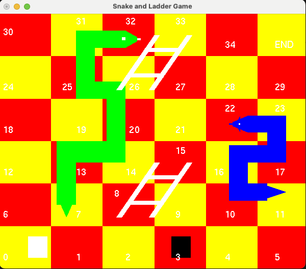

# 🎲 Snake and Ladder Game 🎲

A **Computer Graphics project** developed as part of the **Computer Graphics course** during my **Bachelor's at AIUB**. This project simulates the classic **Snake and Ladder game** using **OpenGL (GLUT)**.

## 📸 Game Screenshot
  

## 🛠️ Features
- 🎮 **Player-controlled dice rolls**
- 🐍 **Snakes bring you down**
- 🪜 **Ladders move you up**
- 🖥️ **Rendered using OpenGL**
- 🎲 **Randomized dice rolls**
- 🔄 **Two-player turn-based gameplay**

## 🚀 How to Run (Mac M1/M2)
### **Install Dependencies**
```bash
brew install freeglut
```

### **Compile the Code**
```bash
g++ -o snake_game main.cpp -I/opt/homebrew/opt/freeglut/include -L/opt/homebrew/opt/freeglut/lib -framework OpenGL -framework GLUT
```
### **Run the Game**
```bash
./snake_game
```

## 🎮 How to Play
🖱️ **Click inside the game window** to roll the dice.  
🔄 **Players take turns automatically.**  
🪜 **Ladders boost you up**, while 🐍 **snakes drop you down**.  
🏆 **The first player to reach the final tile wins!**  

## 📌 About the Project
📚 **Course:** *Computer Graphics*  
🏫 **Institution:** [American International University-Bangladesh (AIUB)](https://www.aiub.edu/)  
🖥️ **Technology Used:** OpenGL (GLUT), C++  
📅 **Year:** 2014  


